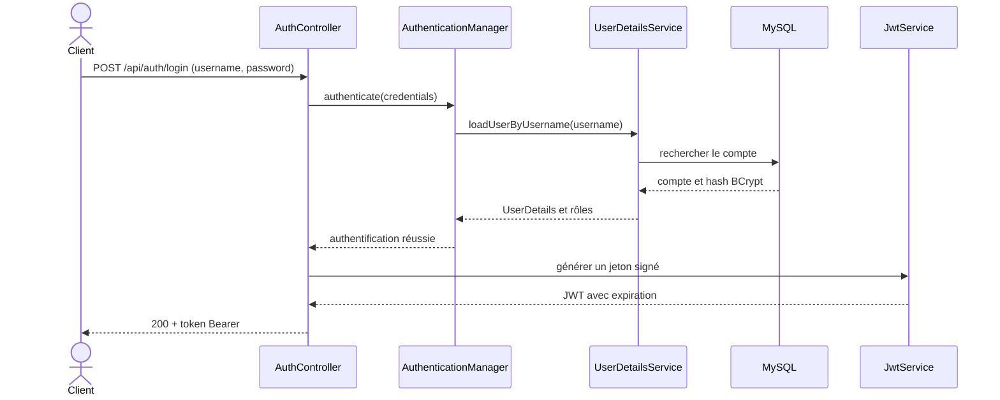

# Séquence d'authentification JWT

```mermaid
sequenceDiagram
    actor Client
    participant Auth as AuthController
    participant Manager as AuthenticationManager
    participant Users as UserDetailsService
    participant DB as MySQL
    participant JWT as JwtService

    Client->>Auth: POST /api/auth/login (username, password)
    Auth->>Manager: authenticate(credentials)
    Manager->>Users: loadUserByUsername(username)
    Users->>DB: rechercher le compte
    DB-->>Users: compte et hash BCrypt
    Users-->>Manager: UserDetails et rôles
    Manager-->>Auth: authentification réussie
    Auth->>JWT: générer un jeton signé
    JWT-->>Auth: JWT avec expiration
    Auth-->>Client: 200 + token Bearer
```

Le mot de passe n'est pas inclus dans le jeton. L'inscription publique crée uniquement des comptes `USER`.
