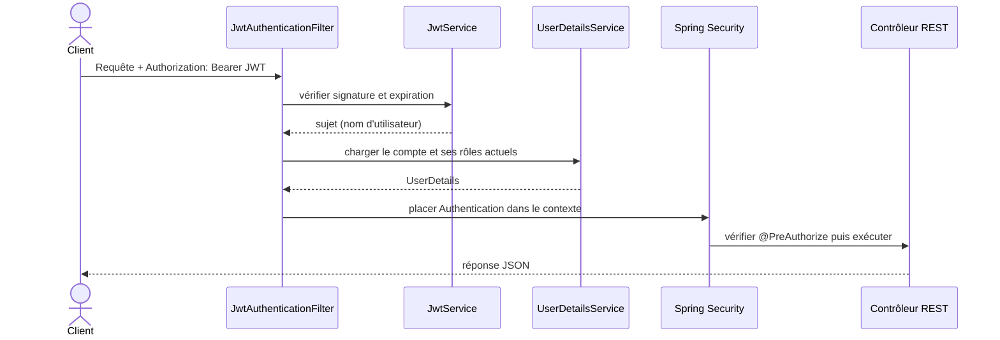

# Parcours d'une requête protégée

```mermaid
sequenceDiagram
    actor Client
    participant Filter as JwtAuthenticationFilter
    participant JWT as JwtService
    participant Users as UserDetailsService
    participant Security as Spring Security
    participant Controller as Contrôleur REST

    Client->>Filter: Requête + Authorization: Bearer JWT
    Filter->>JWT: vérifier signature et expiration
    JWT-->>Filter: sujet (nom d'utilisateur)
    Filter->>Users: charger le compte et ses rôles actuels
    Users-->>Filter: UserDetails
    Filter->>Security: placer Authentication dans le contexte
    Security->>Controller: vérifier @PreAuthorize puis exécuter
    Controller-->>Client: réponse JSON
```

Sans authentification ou avec un jeton invalide, l'API renvoie `401`. Un rôle insuffisant renvoie `403`.
